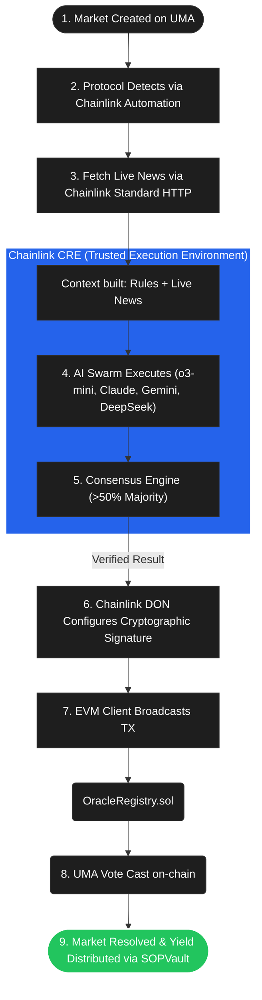
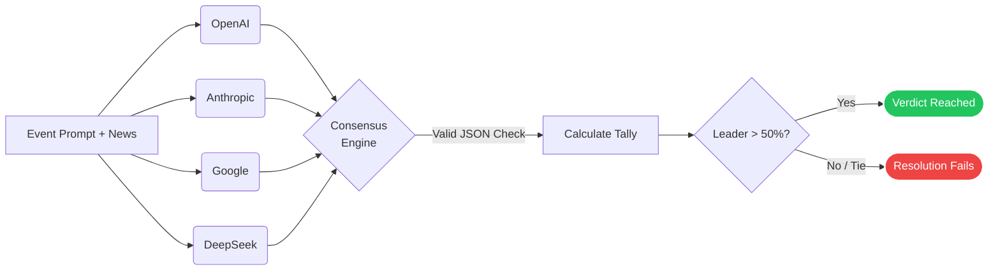

# Swarm Oracle Protocol (SOP)

<p align="center">
  <em>Automated, unbiased UMA voting via a globally diverse AI swarm — secured end-to-end by Chainlink infrastructure.</em>
</p>

## Overview

The **Swarm Oracle Protocol (SOP)** is a decentralized yield and voting aggregation layer built on top of the UMA mechanism. It is designed to solve the critical "Conflict of Interest" and "Gas Barrier" flaws inherent in UMA's current optimistic oracle design by automating dispute resolution using a deterministic, multi-model AI swarm grounded in verifiable real-world news.

SOP allows users to passively delegate their UMA tokens to a smart contract (`SOPVault`) which then votes automatically on ***every*** eligible market, using a single transaction. This completely removes the gas burden from retail stakers while ensuring historically accurate, unbiased market resolutions.

## The Problem: UMA's Riggable Design

Currently, UMA token holders act as the final judges in market disputes. This introduces severe systemic vulnerabilities:
1. **Conflict of Interest (Whale Dominance):** Whales can simultaneously hold large bets on prediction markets *and* control the UMA dispute vote. If the profit from a rigged bet exceeds the slashing penalty, the rational choice is to vote against reality.
2. **Gas Barriers:** Surging gas costs make voting uneconomic for smaller holders. As retail participation collapses, it becomes exponentially cheaper for whales to buy the vote.

*Documented Incidents (e.g., $7M Ukraine Deal, $160M Zelenskyy Suit)* have shown that the UMA oracle can and will ignore global media consensus if the economic incentives align for whales to rule against reality.

## The Solution: Consolidate, Automate, Verifiable Decentralization

SOP restructures the voting mechanics:
- **Vote Consolidation:** All delegated UMA votes are aggregated into a single on-chain transaction. Every staker's voice counts regardless of gas prices.
- **AI Swarm + News Context:** Deterministic AI agents analyze the market. Chainlink fetches live news from verified outlets (Reuters, CNN, BBC) directly into the prompt context so agents decide on *facts*, not hallucinations.
- **Global Model Mix:** A diverse consensus pool (OpenAI, Anthropic, Google, DeepSeek) spanning different geographies and corporate guidelines ensures no single provider can politically skew the results.

## High-Level Workflow

Below is the end-to-end architecture of how SOP securely resolves a market using Chainlink as the backbone for both off-chain computation and on-chain settlement.


## The AI Committee (Swarm) & Consensus Engine

SOP relies on a fully deterministic and transparent consensus engine executed across multiple state-of-the-art LLMs. The orchestration script `swarm.ts` manages this process.

### 1. The Swarm Mix
To avoid corporate, political, or geographical biases, SOP mandates a diverse set of AI models to form the "committee". The current implementation supports:
- **OpenAI (o3-mini)**
- **Anthropic (Claude 3.5 Sonnet)**
- **Google (Gemini 2.5 Flash)**
- **DeepSeek (Reasoner)**

Each agent acts as an independent voter and is fed the exact same prompt context: the market question, the resolution rules, and the live news context.

### 2. Source Weight Algorithm
*Not all sources are equal.* Reddit and 4chan often spread unconfirmed rumors hours before established outlets. Including them at full weight biases the vote, while entirely excluding them removes an early signal. 

SOP utilizes a **Source Weight Algorithm**:
- **High Weight:** Reuters, AP, BBC, CNN, AccuWeather, Official Gov Feeds.
- **Low Weight:** Reddit, unverified Telegram channels, social media posts.

*Crucially, a low-weight source cannot swing a consensus on its own—it can only corroborate a high-weight signal.* The AI swarm's consensus vote is weighted—not just counted—by source quality.

### 3. The Consensus Logic (`consensus.ts`)
Once the Swarm executes, the consensus aggregator calculates the final verdict based on a strict deterministic rule set:
1. **JSON Validation:** Every AI must return a strictly formatted JSON with its step-by-step `reasoning` and a `selected_option`.
2. **Absolute Majority Requirement:** The leading option must secure strictly **>50% of the total valid votes**.
3. **Fail-Safe Mechanism:** If there is a tie, or the leading option fails to cross the 50% threshold, the consensus *fails* gracefully, and no action is taken on-chain.



## Smart Contracts & UMA Integration

The on-chain portion of SOP leverages the optimistic nature of UMA but removes the gas burden entirely from retail actors. It accomplishes this via two primary smart contracts.

### `SOPVault.sol`
Users interact with the protocol via the Staking Hub UI, delegating their UMA to `SOPVault.sol`.
- **Functions:** Aggregates delegated UMA balance.
- **Vote Consolidation:** When a market opens, SOP orchestrates *one single UMA vote transaction* on behalf of all locked UMA balances.
- **The Result:** Instead of 1,000 retail users paying 1,000 individual gas fees to vote, the vault pays gas 1 time.
- **Yield Capture:** 90% of UMA vote rewards are split algorithmically back to the retail stakers. The protocol retains 10%.

### `OracleRegistry.sol`
This is the bridge between the off-chain Chainlink CRE enclave and the on-chain application. 
- The smart contract has strict role-based access control (`onlyCRE`).
- Only properly authenticated Chainlink DONs can call the `recordVerdict()` function.
- It records exactly two pieces of verified information: the Polymarket/UMA Event ID and the definitive string outcome decided by the Swarm.

---

## The Chainlink Infrastructure 

The entire SOP architecture stands on four pillars of Chainlink technology, offering end-to-end guarantees.

### 1. Chainlink CRE (Confidential Runtime Environment)
All Swarm execution logic runs securely inside a Chainlink CRE TEE (Trusted Execution Environment). 
- API keys for all 4 AI providers are injected inside the enclave via **DON Secrets (`{{.secretKey}}`)**. They are never exposed in plaintext code or hardware memory.
- The DON cryptographically signs the AI verdict before it touches the blockchain, proving the payload was un-tampered.

### 2. Chainlink Standard HTTP (Fact Grounding)
Before engaging the AI models, SOP utilizes Standard HTTP Jobs (`news_fetcher.ts`) to programmatically fetch live articles about the market from Reuters, CNN, and the BBC. This deterministic context completely eliminates "hallucinations" about real-world events. 

### 3. Chainlink Automation (Detection)
A Chainlink Automation Upkeep actively monitors the UMA blockchain for new votable market events. Discovered markets immediately trigger the AI Swarm pipeline dynamically—eschewing centralized cron jobs or fallible manual intervention.

### 4. EVM Client (On-Chain Settlement)
Once a consensus is reached, the Chainlink EVM Client encapsulates the signed verdict payload and natively bridges it to `OracleRegistry.sol` using standard `ethers`/`viem` interfaces.
---

## Getting Started & Local Development

SOP is split into two primary environments: the Next.js Frontend (Staking Hub) and the Node.js/TypeScript logic that powers the Chainlink CRE integration.

### Prerequisites
- Node.js (v18+)
- Foundry (for smart contract deployment/testing)
- Valid API keys for OpenAI, Anthropic, Google, and DeepSeek.

### 1. Smart Contracts
Navigate to the `contracts/` directory to build and deploy the `SOPVault` and `OracleRegistry`.

```bash
cd contracts
forge install
forge build
forge test
```
*Note: Ensure your `.env` is configured with an RPC URL and Private Key before deploying.*

### 2. The Chainlink CRE Workflow
The core Swarm and Consensus logic lives in `cre-workflow/`. 

```bash
cd cre-workflow
npm install
```

Configure your environment variables:
```bash
cp .env.example .env
# Add your LLM keys here: OPENAI_API_KEY, ANTHROPIC_API_KEY, etc.
```

To run the full end-to-end swarm simulation on a real Polymarket event:
```bash
npm run test:e2e
```

### 3. The Staking Hub Frontend
The user interface where stakers can delegate their UMA runs on Next.js.

```bash
cd frontend
npm install
npm run dev
```
Navigate to `http://localhost:3000` to interact with the Staking Hub interface.

---
*Built for the Chainlink Convergence Hackathon 2026 by Kerem Eskici*
